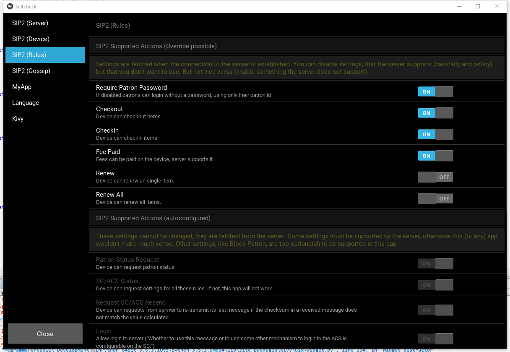
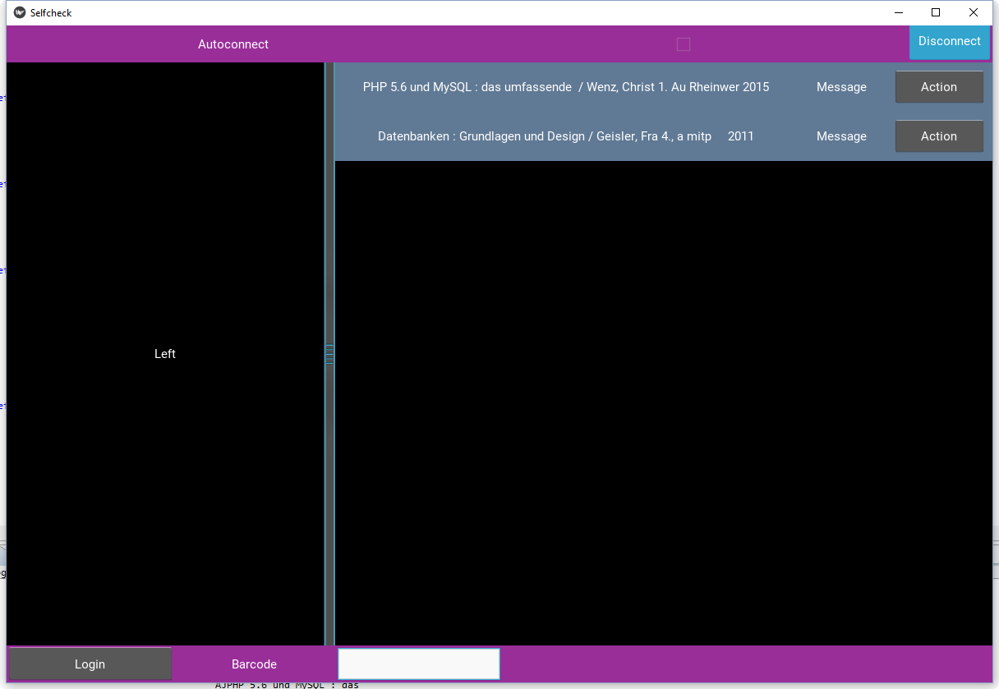

# SelfcheckApp
Intention of the project was to build an application for selfcheck devices using the [SIP2 protocol}(https://github.com/tzeumer/SIP2-Client-for-Python). The GUI was supposed to be based on [Kivy](https://kivy.org/) which would run on any device (mobile to pc, Linux to Windows).

# Status
Since interest in an open source solution wasn't exactly having high marks, this project ended before it really began. Anyway, it "should" not be to hard to get a nice working SelfcheckApp. 

## How to start
* Clone this repository
* [Install Kivy](https://kivy.org/docs/installation/installation.html)
* Download [SIP2-Client-for-Python](https://github.com/tzeumer/SIP2-Client-for-Python) and make it accessible as module (path variable or whatever)

## Implemented (veeery basic)
The few lines given already encompass 
* Multilanguage support (german and english set)
* Configuration for SIP2 client via Menu
* Getting media by barcode into a stack (manually)

## What is missing
A lot... ;)
* Reading media barcodes or RFID data and putting it into the stack (for Tagys there is already a working library: [JkbdRF "RFID Reader acting as keyboard emulator"](https://github.com/GallusMax/JkbdRF). I think even without that library - and depending on the operating system - it is pretty likely you could easily access any device (barcode scanner, rfid antenna) as keyboard input. Only trick is how to monitor and poll input - probably easy if you have any python experience ;)
    * Either you require a user to chose if he wants to checkin or checkout upfront or - much cooler - you determine the item status and the possible actions on the fly when the media is put on the selfcheck device
* Same goes for library card barcodes (or RFID). Building an account screen is simple in itself via SIP2. It might be tricky to update a list of borrowed items without repolling the SIP2 server 
* Send notes on error, especially handle offline cases (server down or something like that)
    * Offline checkout is a very nice feature...
* Make everything beautiful
* Well, thinking about it, there isn't really that much more to do

## Impression

# Other notes
The MIT license is only set to have any license; even though this doesn't really qualify as "work". I don't really care. If you feel like you have to get things straight and prefer any other license, just ask.